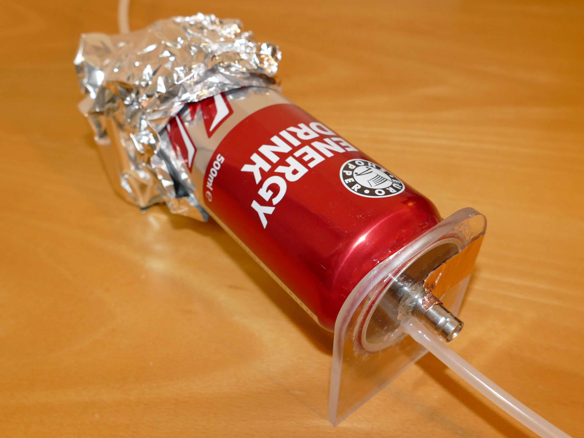
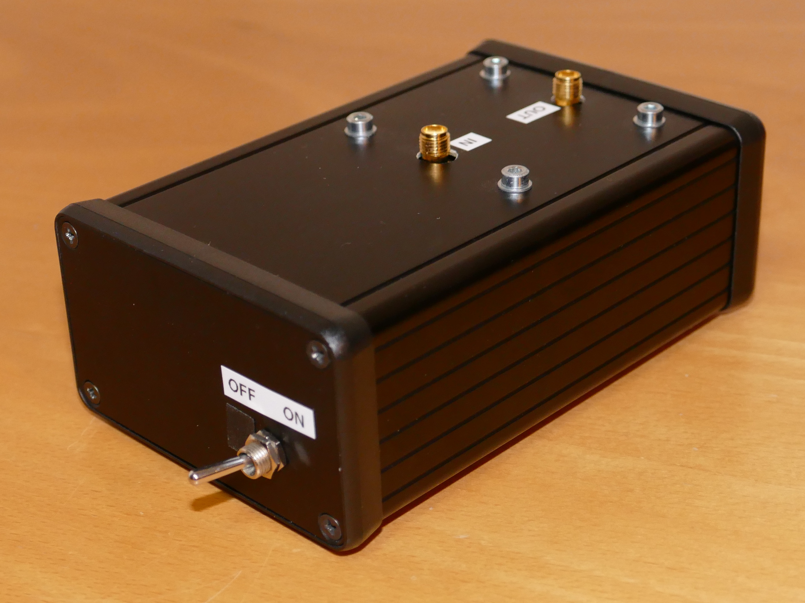
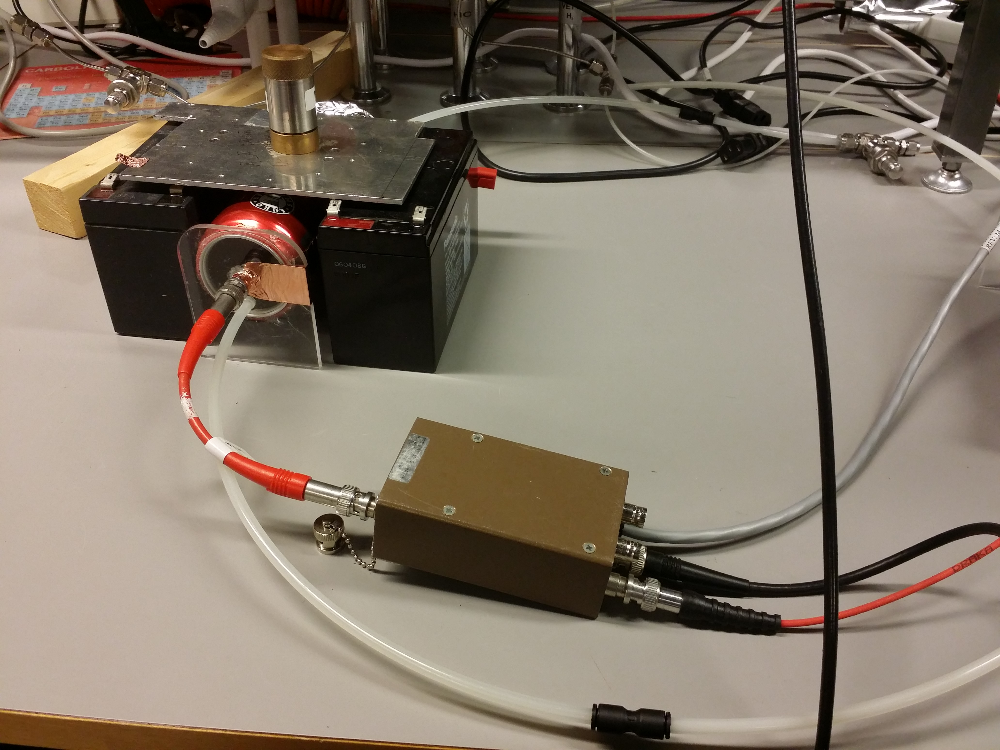

# Proportional counter
## Work in progress

[University of Helsinki](https://www.helsinki.fi/)
[PAP328 Laboratory Course on Instrumentation](https://courses.helsinki.fi/en/pap328)
project work:
[proportional counter](https://en.wikipedia.org/wiki/Proportional_counter)

In this project we built a radiation detector based on a
[drink can](https://en.wikipedia.org/wiki/Drink_can).

We also built a pre-amplifier for the signal produced by the detector.

The setup was tested with radioactive sources of both
241Am and 55 isotopes.

